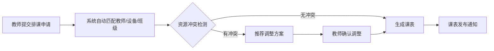
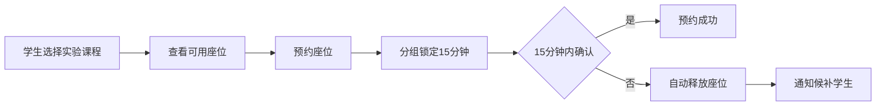
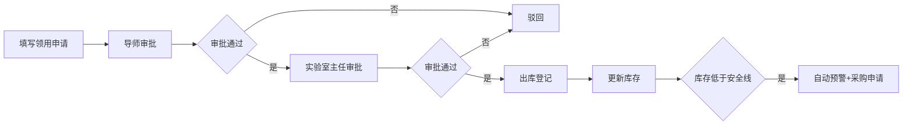

## 1. 产品概述

实验教学管理平台是一套面向高校实验室的全流程数字化管理系统，整合排课、预约、借用、报告成绩、危化品管控及实时监控六大核心模块，实现实验室资源高效配置、教学过程可追溯、安全风险可控。目标用户包括学生、教师、实验室管理员和学院领导四级角色，通过精细化权限管理满足不同岗位的工作需求。

## 2. 核心功能

### 2.1 用户角色

| 角色 | 登录方式 | 核心权限 |
|------|---------|----------|
| 学生 | 账号登录 | 预约实验座位、查看成绩、提交实验报告、借用设备 |
| 教师 | 账号登录 | 排课管理、批改实验报告、查看课程数据、审批设备借用 |
| 实验室管理员 | 账号登录 | 资源管理、设备管理、危化品管控、数据导出、查看监控 |
| 学院领导 | 账号登录 | 全局数据查看、月度分析报告、权限管理、审批采购申请 |

### 2.2 功能模块

1. **首页大屏**：实时监控数据展示、实验室占用率、设备完好率、今日实验人次、报告提交率
2. **排课管理**：自动生成课表、资源冲突检测、调整方案推荐、课表查询导出
3. **预约管理**：座位预约、分组锁定15分钟、超时自动释放、候补通知
4. **设备借用**：借用申请、用途时长填写、逾期提醒、信用分管理
5. **报告与成绩**：在线提交、自动查重、教师批改、权重自动汇总
6. **危化品管控**：领用申请、两级审批、库存预警、采购申请
7. **数据导出**：多维度筛选、月度教学分析报告、耗材消耗明细

### 2.3 页面详情

| 页面名称 | 模块名称 | 功能描述 |
|---------|---------|---------|
| 登录页 | 身份认证 | 账号密码登录、角色选择、记住密码 |
| 首页大屏 | 实时监控 | 数据卡片、趋势图表、实验室状态、5秒自动刷新 |
| 排课管理 | 课表生成 | 教师/实验室/班级选择、自动排课、冲突检测、调整推荐 |
| 预约管理 | 座位预约 | 实验室座位图、预约锁定、超时释放、候补队列 |
| 设备借用 | 借用管理 | 设备列表、借用申请、归还登记、逾期提醒、信用分 |
| 实验报告 | 报告管理 | 在线提交、自动查重、教师批改、成绩录入 |
| 成绩管理 | 成绩汇总 | 成绩列表、权重配置、自动计算、导出报表 |
| 危化品管理 | 危化品管控 | 库存管理、领用审批、安全预警、采购申请 |
| 数据中心 | 数据导出 | 多条件筛选、月度报告、耗材明细、一键导出 |
| 个人中心 | 个人信息 | 密码修改、信用分查看、预约记录、借用历史 |

## 3. 核心流程

### 3.1 排课流程

### 3.2 预约流程

### 3.3 危化品领用流程

## 4. 用户界面设计

### 4.1 设计风格
- **主色调**：科技蓝（#165DFF）作为主色，搭配深灰（#1D2129）作为背景
- **辅助色**：成功绿（#00B42A）、警告橙（#FF7D00）、危险红（#F53F3F）
- **按钮风格**：圆角8px，悬停阴影效果，主按钮渐变背景
- **字体**：标题使用"Noto Sans SC" Bold，正文使用"Noto Sans SC" Regular
- **布局风格**：侧边导航+顶部工具栏+内容区域三栏布局，卡片式内容展示
- **图标风格**：使用Lucide图标库，线性风格，统一24px尺寸

### 4.2 页面设计概述

| 页面名称 | 模块名称 | UI元素 |
|---------|---------|--------|
| 首页大屏 | 实时监控 | 深色背景、发光数据卡片、动态折线图、环形进度图、网格布局、呼吸灯动画 |
| 排课管理 | 课表生成 | 周视图日历、时间轴、冲突高亮标记、推荐方案弹窗、拖拽调整 |
| 预约管理 | 座位预约 | 实验室座位平面图、座位状态色标、倒计时器、候补队列列表 |
| 设备借用 | 借用管理 | 设备卡片网格、借用表单、进度时间线、信用分仪表盘 |
| 实验报告 | 报告管理 | 富文本编辑器、查重相似度仪表盘、批注功能、成绩滑块 |
| 危化品管理 | 危化品管控 | 库存表格、审批流程条、预警红色标识、化学品分类标签 |
| 数据中心 | 数据导出 | 筛选条件面板、图表预览、导出按钮组、进度条 |

### 4.3 响应式设计
- **桌面优先**：1920px及以上为主要设计尺寸
- **平板适配**：1024px-1280px，侧边栏可折叠，内容区域自适应
- **移动适配**：768px以下，顶部导航，底部Tab切换，简化数据展示

### 4.4 动画与交互
- **数据刷新**：数字滚动动画、图表平滑过渡
- **悬停效果**：卡片上浮、阴影加深、边框高亮
- **加载状态**：骨架屏、脉冲动画、进度条
- **状态变化**：成功/错误提示滑入、确认弹窗淡入淡出
- **大屏特效**：数字发光、图表渐入、背景网格微动
