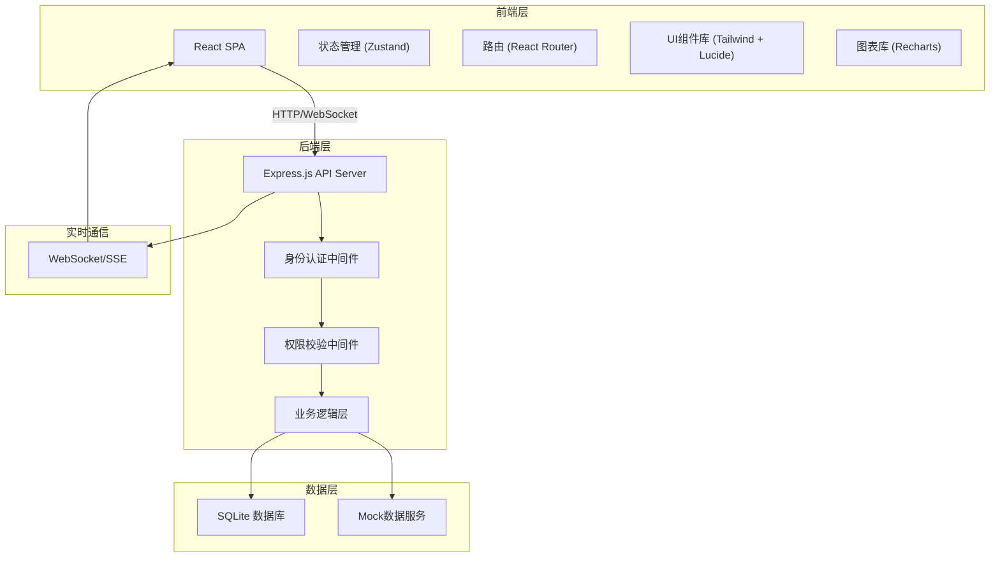
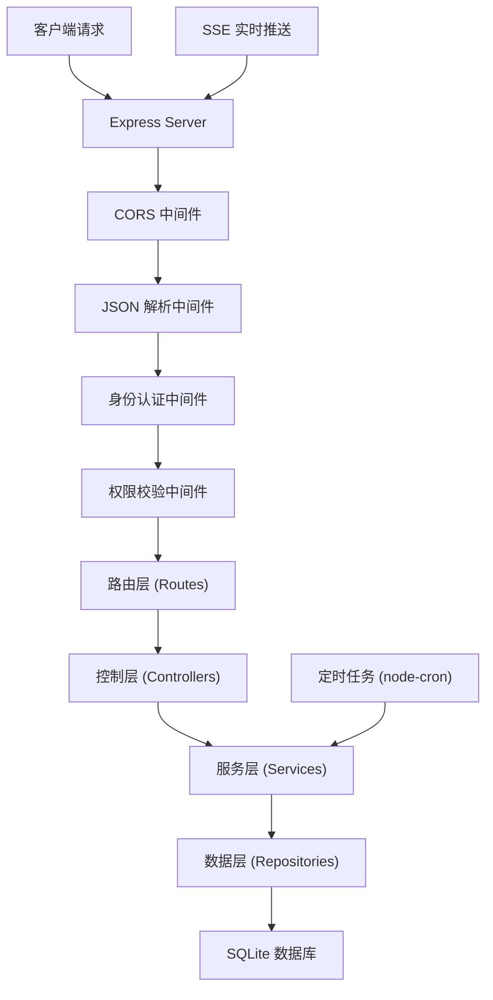
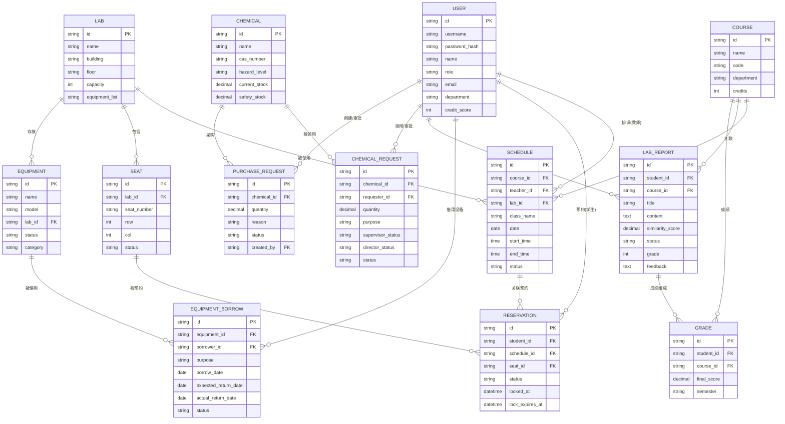

## 1. 架构设计



## 2. 技术描述

- **前端框架**: React@18 + TypeScript
- **构建工具**: Vite@5
- **状态管理**: Zustand@4
- **路由管理**: React Router DOM@6
- **UI框架**: Tailwind CSS@3
- **图标库**: Lucide React@0.294
- **图表库**: Recharts@2
- **后端框架**: Express@4 + TypeScript
- **数据库**: SQLite (通过better-sqlite3)
- **HTTP客户端**: Axios
- **实时通信**: Server-Sent Events (SSE)
- **日期处理**: Day.js

## 3. 路由定义

| 路由 | 页面 | 权限角色 | 说明 |
|------|------|---------|------|
| /login | 登录页 | 公开 | 用户身份认证 |
| /dashboard | 首页大屏 | 所有登录用户 | 实时监控数据展示 |
| /schedule | 排课管理 | 教师、管理员、领导 | 课表生成与管理 |
| /reservation | 预约管理 | 学生、教师 | 实验座位预约 |
| /equipment | 设备借用 | 学生、教师、管理员 | 设备借用与归还 |
| /report | 实验报告 | 学生、教师 | 报告提交与批改 |
| /grade | 成绩管理 | 学生、教师、管理员 | 成绩查看与汇总 |
| /chemical | 危化品管理 | 教师、管理员、领导 | 危化品领用与库存 |
| /data | 数据中心 | 管理员、领导 | 数据筛选与导出 |
| /profile | 个人中心 | 所有登录用户 | 个人信息与记录 |

## 4. API 定义

### 4.1 TypeScript 类型定义

```typescript
// 用户相关类型
type UserRole = 'student' | 'teacher' | 'admin' | 'leader';

interface User {
  id: string;
  username: string;
  name: string;
  role: UserRole;
  email: string;
  phone: string;
  department: string;
  creditScore: number;
  avatar?: string;
}

// 排课相关类型
interface Schedule {
  id: string;
  courseId: string;
  courseName: string;
  teacherId: string;
  teacherName: string;
  labId: string;
  labName: string;
  classId: string;
  className: string;
  date: string;
  startTime: string;
  endTime: string;
  status: 'scheduled' | 'ongoing' | 'completed' | 'cancelled';
  conflict?: boolean;
  conflictInfo?: string;
}

interface ScheduleConflict {
  type: 'teacher' | 'lab' | 'equipment';
  message: string;
  suggestions: ScheduleSuggestion[];
}

interface ScheduleSuggestion {
  alternativeTime: string;
  alternativeLab?: string;
  reason: string;
}

// 预约相关类型
interface Reservation {
  id: string;
  studentId: string;
  studentName: string;
  scheduleId: string;
  labId: string;
  seatId: string;
  seatNumber: string;
  groupId?: string;
  status: 'pending' | 'locked' | 'confirmed' | 'cancelled' | 'completed';
  lockedAt?: string;
  lockExpiresAt?: string;
  createdAt: string;
}

interface Seat {
  id: string;
  labId: string;
  seatNumber: string;
  row: number;
  col: number;
  status: 'available' | 'occupied' | 'locked' | 'maintenance';
  equipment: string[];
}

// 设备借用相关类型
interface Equipment {
  id: string;
  name: string;
  model: string;
  brand: string;
  labId: string;
  status: 'available' | 'borrowed' | 'maintenance' | 'lost';
  category: string;
  purchaseDate: string;
  price: number;
}

interface EquipmentBorrow {
  id: string;
  equipmentId: string;
  equipmentName: string;
  borrowerId: string;
  borrowerName: string;
  purpose: string;
  borrowDate: string;
  expectedReturnDate: string;
  actualReturnDate?: string;
  status: 'pending' | 'approved' | 'rejected' | 'borrowed' | 'returned' | 'overdue';
  approverId?: string;
  creditPenalty?: number;
}

// 实验报告相关类型
interface LabReport {
  id: string;
  studentId: string;
  studentName: string;
  courseId: string;
  courseName: string;
  title: string;
  content: string;
  attachments?: string[];
  similarityScore?: number;
  status: 'draft' | 'submitted' | 'reviewing' | 'graded' | 'rejected';
  grade?: number;
  feedback?: string;
  graderId?: string;
  submittedAt: string;
  gradedAt?: string;
}

// 成绩相关类型
interface Grade {
  id: string;
  studentId: string;
  studentName: string;
  courseId: string;
  courseName: string;
  reportGrades: { reportId: string; title: string; score: number; weight: number }[];
  operationScore: number;
  operationWeight: number;
  finalScore: number;
  semester: string;
}

// 危化品相关类型
interface Chemical {
  id: string;
  name: string;
  casNumber: string;
  category: string;
  hazardLevel: 'low' | 'medium' | 'high' | 'extreme';
  unit: string;
  currentStock: number;
  safetyStock: number;
  unitPrice: number;
  location: string;
}

interface ChemicalRequest {
  id: string;
  chemicalId: string;
  chemicalName: string;
  requesterId: string;
  requesterName: string;
  quantity: number;
  purpose: string;
  supervisorId: string;
  supervisorStatus: 'pending' | 'approved' | 'rejected';
  supervisorComment?: string;
  directorId: string;
  directorStatus: 'pending' | 'approved' | 'rejected';
  directorComment?: string;
  status: 'pending' | 'approved' | 'rejected' | 'completed';
  createdAt: string;
}

interface PurchaseRequest {
  id: string;
  chemicalId: string;
  chemicalName: string;
  quantity: number;
  reason: string;
  status: 'pending' | 'approved' | 'rejected' | 'ordered' | 'received';
  createdBy: string;
  createdAt: string;
}

// 监控数据类型
interface DashboardStats {
  labOccupancy: { labId: string; labName: string; rate: number }[];
  equipmentCondition: { total: number; good: number; maintenance: number; broken: number };
  todayStudents: number;
  reportSubmissionRate: number;
  hourlyTrend: { hour: number; count: number }[];
  labStatus: { id: string; name: string; status: 'free' | 'occupied' | 'maintenance'; currentCourse?: string }[];
  alerts: { id: string; type: 'warning' | 'danger'; message: string; timestamp: string }[];
}
```

### 4.2 API 接口列表

| 方法 | 路径 | 说明 | 权限 |
|------|------|------|------|
| POST | /api/auth/login | 用户登录 | 公开 |
| GET | /api/auth/me | 获取当前用户信息 | 所有登录用户 |
| GET | /api/schedule | 获取课表列表 | 教师、管理员、领导 |
| POST | /api/schedule | 创建排课 | 教师、管理员 |
| POST | /api/schedule/check-conflict | 检测排课冲突 | 教师、管理员 |
| GET | /api/schedule/generate | 自动生成课表 | 教师、管理员 |
| GET | /api/reservation | 获取预约列表 | 学生、教师 |
| POST | /api/reservation | 创建预约 | 学生 |
| POST | /api/reservation/:id/confirm | 确认预约 | 学生 |
| GET | /api/reservation/lab/:labId/seats | 获取实验室座位 | 学生、教师 |
| GET | /api/equipment | 获取设备列表 | 所有登录用户 |
| POST | /api/equipment/borrow | 借用设备 | 学生、教师 |
| POST | /api/equipment/:id/return | 归还设备 | 学生、教师 |
| GET | /api/equipment/borrow/my | 获取我的借用记录 | 学生、教师 |
| GET | /api/report | 获取报告列表 | 学生、教师 |
| POST | /api/report | 提交实验报告 | 学生 |
| POST | /api/report/:id/check-similarity | 报告查重 | 教师、管理员 |
| POST | /api/report/:id/grade | 批改报告 | 教师 |
| GET | /api/grade | 获取成绩列表 | 学生、教师、管理员 |
| GET | /api/grade/calculate | 计算最终成绩 | 教师、管理员 |
| GET | /api/chemical | 获取危化品列表 | 教师、管理员、领导 |
| POST | /api/chemical/request | 申请领用危化品 | 教师 |
| POST | /api/chemical/request/:id/approve-supervisor | 导师审批 | 教师 |
| POST | /api/chemical/request/:id/approve-director | 主任审批 | 管理员、领导 |
| GET | /api/chemical/purchase-requests | 获取采购申请 | 管理员、领导 |
| POST | /api/chemical/purchase-requests | 创建采购申请 | 管理员 |
| GET | /api/dashboard/stats | 获取首页统计数据 | 所有登录用户 |
| GET | /api/dashboard/stats/stream | 实时数据推送 (SSE) | 所有登录用户 |
| GET | /api/data/export/monthly-report | 导出月度报告 | 管理员、领导 |
| GET | /api/data/export/materials | 导出耗材明细 | 管理员、领导 |
| GET | /api/users | 获取用户列表 | 管理员、领导 |
| PUT | /api/users/:id | 更新用户信息 | 管理员、领导 |

## 5. 服务器架构



## 6. 数据模型

### 6.1 ER 图



### 6.2 DDL 语句

```sql
-- 用户表
CREATE TABLE users (
    id TEXT PRIMARY KEY,
    username TEXT UNIQUE NOT NULL,
    password_hash TEXT NOT NULL,
    name TEXT NOT NULL,
    role TEXT NOT NULL CHECK(role IN ('student', 'teacher', 'admin', 'leader')),
    email TEXT,
    phone TEXT,
    department TEXT,
    credit_score INTEGER DEFAULT 100,
    avatar TEXT,
    created_at DATETIME DEFAULT CURRENT_TIMESTAMP,
    updated_at DATETIME DEFAULT CURRENT_TIMESTAMP
);

-- 实验室表
CREATE TABLE labs (
    id TEXT PRIMARY KEY,
    name TEXT NOT NULL,
    building TEXT,
    floor TEXT,
    capacity INTEGER NOT NULL,
    description TEXT,
    created_at DATETIME DEFAULT CURRENT_TIMESTAMP
);

-- 座位表
CREATE TABLE seats (
    id TEXT PRIMARY KEY,
    lab_id TEXT NOT NULL REFERENCES labs(id),
    seat_number TEXT NOT NULL,
    row INTEGER NOT NULL,
    col INTEGER NOT NULL,
    status TEXT NOT NULL DEFAULT 'available' CHECK(status IN ('available', 'occupied', 'locked', 'maintenance')),
    equipment TEXT,
    created_at DATETIME DEFAULT CURRENT_TIMESTAMP
);

-- 课程表
CREATE TABLE courses (
    id TEXT PRIMARY KEY,
    name TEXT NOT NULL,
    code TEXT UNIQUE NOT NULL,
    department TEXT,
    credits INTEGER DEFAULT 0,
    created_at DATETIME DEFAULT CURRENT_TIMESTAMP
);

-- 排课表
CREATE TABLE schedules (
    id TEXT PRIMARY KEY,
    course_id TEXT NOT NULL REFERENCES courses(id),
    course_name TEXT NOT NULL,
    teacher_id TEXT NOT NULL REFERENCES users(id),
    teacher_name TEXT NOT NULL,
    lab_id TEXT NOT NULL REFERENCES labs(id),
    lab_name TEXT NOT NULL,
    class_name TEXT NOT NULL,
    date DATE NOT NULL,
    start_time TIME NOT NULL,
    end_time TIME NOT NULL,
    status TEXT NOT NULL DEFAULT 'scheduled' CHECK(status IN ('scheduled', 'ongoing', 'completed', 'cancelled')),
    created_at DATETIME DEFAULT CURRENT_TIMESTAMP,
    updated_at DATETIME DEFAULT CURRENT_TIMESTAMP
);

-- 预约表
CREATE TABLE reservations (
    id TEXT PRIMARY KEY,
    student_id TEXT NOT NULL REFERENCES users(id),
    student_name TEXT NOT NULL,
    schedule_id TEXT NOT NULL REFERENCES schedules(id),
    lab_id TEXT NOT NULL REFERENCES labs(id),
    seat_id TEXT NOT NULL REFERENCES seats(id),
    seat_number TEXT NOT NULL,
    group_id TEXT,
    status TEXT NOT NULL DEFAULT 'pending' CHECK(status IN ('pending', 'locked', 'confirmed', 'cancelled', 'completed')),
    locked_at DATETIME,
    lock_expires_at DATETIME,
    created_at DATETIME DEFAULT CURRENT_TIMESTAMP,
    updated_at DATETIME DEFAULT CURRENT_TIMESTAMP
);

-- 设备表
CREATE TABLE equipments (
    id TEXT PRIMARY KEY,
    name TEXT NOT NULL,
    model TEXT,
    brand TEXT,
    lab_id TEXT REFERENCES labs(id),
    status TEXT NOT NULL DEFAULT 'available' CHECK(status IN ('available', 'borrowed', 'maintenance', 'lost')),
    category TEXT,
    purchase_date DATE,
    price REAL DEFAULT 0,
    created_at DATETIME DEFAULT CURRENT_TIMESTAMP
);

-- 设备借用表
CREATE TABLE equipment_borrows (
    id TEXT PRIMARY KEY,
    equipment_id TEXT NOT NULL REFERENCES equipments(id),
    equipment_name TEXT NOT NULL,
    borrower_id TEXT NOT NULL REFERENCES users(id),
    borrower_name TEXT NOT NULL,
    purpose TEXT NOT NULL,
    borrow_date DATE NOT NULL,
    expected_return_date DATE NOT NULL,
    actual_return_date DATE,
    status TEXT NOT NULL DEFAULT 'pending' CHECK(status IN ('pending', 'approved', 'rejected', 'borrowed', 'returned', 'overdue')),
    approver_id TEXT REFERENCES users(id),
    credit_penalty INTEGER DEFAULT 0,
    created_at DATETIME DEFAULT CURRENT_TIMESTAMP,
    updated_at DATETIME DEFAULT CURRENT_TIMESTAMP
);

-- 实验报告表
CREATE TABLE lab_reports (
    id TEXT PRIMARY KEY,
    student_id TEXT NOT NULL REFERENCES users(id),
    student_name TEXT NOT NULL,
    course_id TEXT NOT NULL REFERENCES courses(id),
    course_name TEXT NOT NULL,
    title TEXT NOT NULL,
    content TEXT NOT NULL,
    attachments TEXT,
    similarity_score REAL,
    status TEXT NOT NULL DEFAULT 'draft' CHECK(status IN ('draft', 'submitted', 'reviewing', 'graded', 'rejected')),
    grade INTEGER,
    feedback TEXT,
    grader_id TEXT REFERENCES users(id),
    submitted_at DATETIME,
    graded_at DATETIME,
    created_at DATETIME DEFAULT CURRENT_TIMESTAMP,
    updated_at DATETIME DEFAULT CURRENT_TIMESTAMP
);

-- 成绩表
CREATE TABLE grades (
    id TEXT PRIMARY KEY,
    student_id TEXT NOT NULL REFERENCES users(id),
    student_name TEXT NOT NULL,
    course_id TEXT NOT NULL REFERENCES courses(id),
    course_name TEXT NOT NULL,
    report_grades TEXT,
    operation_score INTEGER DEFAULT 0,
    operation_weight INTEGER DEFAULT 30,
    final_score REAL NOT NULL,
    semester TEXT NOT NULL,
    created_at DATETIME DEFAULT CURRENT_TIMESTAMP,
    updated_at DATETIME DEFAULT CURRENT_TIMESTAMP
);

-- 危化品表
CREATE TABLE chemicals (
    id TEXT PRIMARY KEY,
    name TEXT NOT NULL,
    cas_number TEXT,
    category TEXT,
    hazard_level TEXT NOT NULL CHECK(hazard_level IN ('low', 'medium', 'high', 'extreme')),
    unit TEXT NOT NULL,
    current_stock REAL NOT NULL DEFAULT 0,
    safety_stock REAL NOT NULL DEFAULT 0,
    unit_price REAL DEFAULT 0,
    location TEXT,
    created_at DATETIME DEFAULT CURRENT_TIMESTAMP,
    updated_at DATETIME DEFAULT CURRENT_TIMESTAMP
);

-- 危化品领用申请表
CREATE TABLE chemical_requests (
    id TEXT PRIMARY KEY,
    chemical_id TEXT NOT NULL REFERENCES chemicals(id),
    chemical_name TEXT NOT NULL,
    requester_id TEXT NOT NULL REFERENCES users(id),
    requester_name TEXT NOT NULL,
    quantity REAL NOT NULL,
    purpose TEXT NOT NULL,
    supervisor_id TEXT NOT NULL REFERENCES users(id),
    supervisor_status TEXT NOT NULL DEFAULT 'pending' CHECK(supervisor_status IN ('pending', 'approved', 'rejected')),
    supervisor_comment TEXT,
    director_id TEXT NOT NULL REFERENCES users(id),
    director_status TEXT NOT NULL DEFAULT 'pending' CHECK(director_status IN ('pending', 'approved', 'rejected')),
    director_comment TEXT,
    status TEXT NOT NULL DEFAULT 'pending' CHECK(status IN ('pending', 'approved', 'rejected', 'completed')),
    created_at DATETIME DEFAULT CURRENT_TIMESTAMP,
    updated_at DATETIME DEFAULT CURRENT_TIMESTAMP
);

-- 采购申请表
CREATE TABLE purchase_requests (
    id TEXT PRIMARY KEY,
    chemical_id TEXT NOT NULL REFERENCES chemicals(id),
    chemical_name TEXT NOT NULL,
    quantity REAL NOT NULL,
    reason TEXT NOT NULL,
    status TEXT NOT NULL DEFAULT 'pending' CHECK(status IN ('pending', 'approved', 'rejected', 'ordered', 'received')),
    created_by TEXT NOT NULL REFERENCES users(id),
    created_at DATETIME DEFAULT CURRENT_TIMESTAMP,
    updated_at DATETIME DEFAULT CURRENT_TIMESTAMP
);

-- 初始化索引
CREATE INDEX idx_schedules_date ON schedules(date);
CREATE INDEX idx_schedules_teacher ON schedules(teacher_id);
CREATE INDEX idx_schedules_lab ON schedules(lab_id);
CREATE INDEX idx_reservations_student ON reservations(student_id);
CREATE INDEX idx_reservations_schedule ON reservations(schedule_id);
CREATE INDEX idx_equipment_borrows_borrower ON equipment_borrows(borrower_id);
CREATE INDEX idx_equipment_borrows_status ON equipment_borrows(status);
CREATE INDEX idx_lab_reports_student ON lab_reports(student_id);
CREATE INDEX idx_lab_reports_course ON lab_reports(course_id);
CREATE INDEX idx_grades_student ON grades(student_id);
CREATE INDEX idx_chemical_requests_requester ON chemical_requests(requester_id);
CREATE INDEX idx_chemical_requests_status ON chemical_requests(status);
CREATE INDEX idx_chemicals_stock ON chemicals(current_stock);
```
